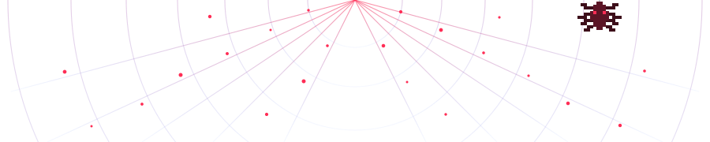
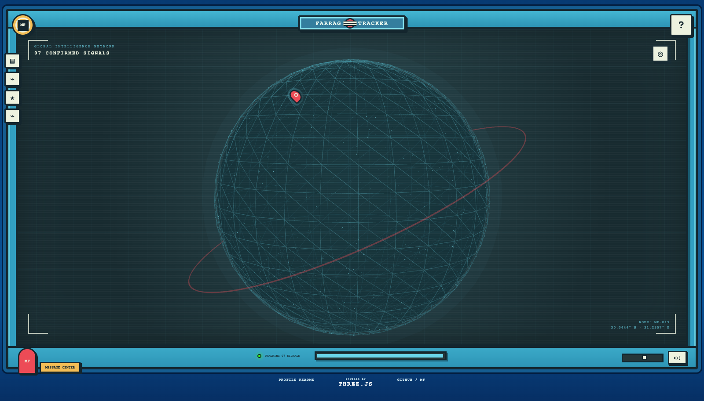
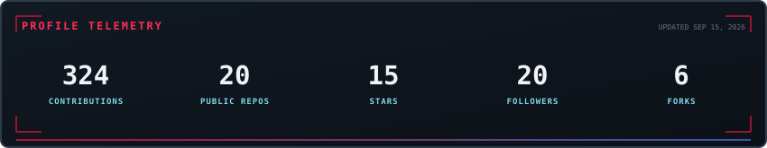
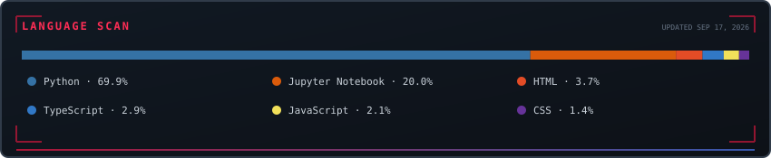
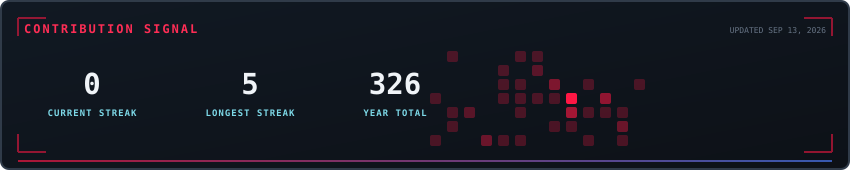
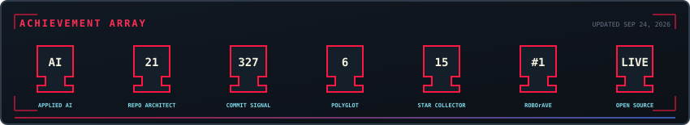

<p align="center">
  
</p>

<h1 align="center">🕷️ FARRAG_TRACKER</h1>

```text
INITIALIZING PROFILE
TARGET ACQUIRED: MUHAMMED FARRAG
ROLE: APPLIED AI ENGINEER
STATUS: ONLINE
```

<p align="center">
  
  
  
  
</p>

---

## 🌐 INTERACTIVE TRACKER

<p align="center">
  <a href="https://muhammed-farrag.github.io/Muhammed-Farrag/">
    
  </a>
</p>

<p align="center">
  <a href="https://muhammed-farrag.github.io/Muhammed-Farrag/"></a>
  <a href="index.html"></a>
</p>

Explore a live, draggable intelligence globe where each signal represents a confirmed role, research program, award, internship, or education milestone. The experience is built with original artwork and Three.js; the preview above links to the interactive GitHub Pages version.

---

## 🕸️ TRACKER LOG

```text
IDENTITY ........ Muhammed Farrag
CLASS ........... Applied AI Engineer
SPECIALTY ....... NLP · Generative AI · LLM Integrations · Anomaly Detection
EDUCATION ....... B.Sc. AI Science — Alamein International University, 2022–2026
```

I build applied AI systems that turn research ideas into reliable products, with a focus on natural language processing, generative AI, LLM integrations, anomaly detection, and production-ready automation.

<p align="center">
  
</p>

---

## 🕸️ SIGHTINGS — CONFIRMED APPEARANCES

<table>
  <thead>
    <tr>
      <th>WHEN</th>
      <th>SIGHTING</th>
      <th>DETAILS</th>
    </tr>
  </thead>
  <tbody>
    <tr>
      <td>Jul 2026 – Aug 2026</td>
      <td><b>The Cluster</b><br><sub>AI Operations Engineer · Cairo, Egypt · Remote</sub></td>
      <td>AI operations at an Egyptian pharma/cosmetics supply-chain startup: data enhancement pipelines, distributor scraping architecture, and documentation.</td>
    </tr>
    <tr>
      <td>Apr 2026 – Aug 2026</td>
      <td><b>GCI World 2026 — Data Science &amp; AI Program</b><br><sub>Matsuo-Iwasawa Lab, University of Tokyo · Remote</sub></td>
      <td>Three-month remote research program covering machine learning, data visualization, and applied data science.</td>
    </tr>
    <tr>
      <td>Feb 2025 – Apr 2026</td>
      <td><b>IEEE AIU Student Branch</b><br><sub>AI Committee Member</sub></td>
      <td>AI Committee Member — 1 yr 3 mos.</td>
    </tr>
    <tr>
      <td>Oct 2025 – Dec 2025</td>
      <td><b>TJM Labs</b><br><sub>Software Engineer · United States · Remote</sub></td>
      <td>AI-powered automation with BotCity, Playwright, and LLM APIs; backend integrations, workflow automation, and scalable API services.</td>
    </tr>
    <tr>
      <td>Jun 2025 – Dec 2025</td>
      <td><b>Digital Egypt Pioneers Initiative (DEPI)</b><br><sub>Internship Trainee · Generative AI Professional Track</sub></td>
      <td>National MCIT initiative covering LLMs, GANs, Hugging Face, ML/DL/CV in Python, prompt engineering, transfer learning, attention-based NLP, capstone work, and deployment ethics.</td>
    </tr>
    <tr>
      <td>Jul 2024 – Aug 2024</td>
      <td><b>stc</b><br><sub>AI &amp; Data Analytics Intern · Saudi Arabia · Remote</sub></td>
      <td>Recommendation systems using collaborative and content-based approaches, customer behavior analysis, preprocessing, feature engineering, and Python with pandas and scikit-learn.</td>
    </tr>
    <tr>
      <td>Jul 2024 – Aug 2024</td>
      <td><b>Information Technology Institute (ITI)</b><br><sub>Software Engineer Intern · Hybrid</sub></td>
      <td>Built a JavaFX application for the Grand Egyptian Museum with a multilingual chatbot, authentication, navigation flows, and modular architecture.</td>
    </tr>
  </tbody>
</table>

---

## ⚡ SKILL SCAN

<p align="center">
  
</p>

```text
[LANGUAGES]     Python · Java · C++ · R · JavaScript · HTML · CSS
[AI / ML]       TensorFlow · PyTorch · LangChain · OpenCV · Data Visualization
[CLOUD/DEVOPS]  Docker · Kubernetes · Terraform · Kafka
[SOFT SKILLS]   Critical Thinking · Communication · Leadership
```

---

## 📊 SPIDER-SENSE — LIVE METRICS

<p align="center">
  
</p>

<p align="center">
  
</p>

<p align="center">
  
</p>

<p align="center">
  
</p>

---

## 🏆 EVENT LOG

| DATE | EVENT | NOTES |
| :--- | :--- | :--- |
| Apr 2026 | DEPI — Top Digital Pioneer Honoree | Recognized by Egypt's MCIT for outstanding performance and innovation. |
| Aug 2025 | RoboRAVE International — Best Creativity Trophy (Beijing, China) | Led Montura to the Excellent Creativity Trophy among 20+ countries with an AI-powered anomaly detection and prevention system integrating CNN, AdaBoost, and BERT. |
| Aug 2025 | RoboRAVE International — Rank 1 (China) | Achieved first-place ranking in China. |
| — | RoboRAVE International — Judge | Served as a competition judge. |

**Certifications:** Programming Generative AI · Mastering Recommendation Systems with Python · LangChain &amp; LangGraph

---

## 🎯 CURRENT MISSION

```text
[ ] Advanced NLP & Generative AI systems
[ ] Emotion-aware conversational AI
[ ] Research-grade AI architectures
```

---

## 📶 COMMS CHANNEL

<p align="center">
  <a href="mailto:mohamed.frage19@gmail.com"></a>
  <a href="https://www.linkedin.com/in/muhammed-farrag-/"></a>
  <a href="https://github.com/Muhammed-Farrag"></a>
</p>

<p align="center">
  
</p>

```text
TRACKER SESSION ENDING
THANKS FOR STOPPING BY
```
